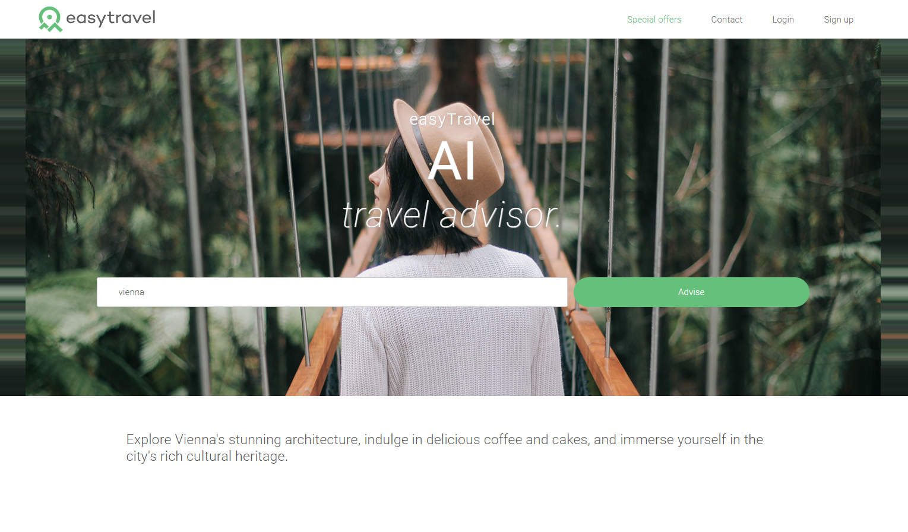
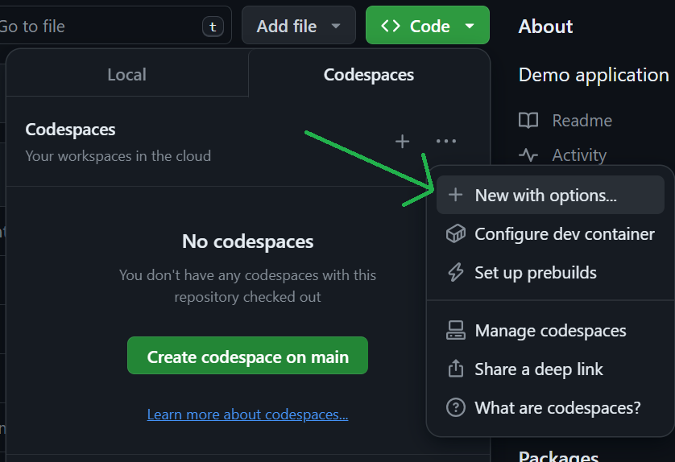
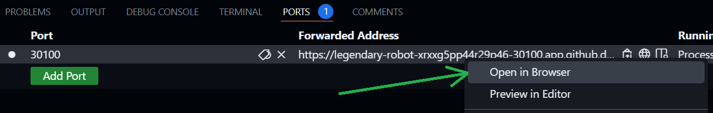
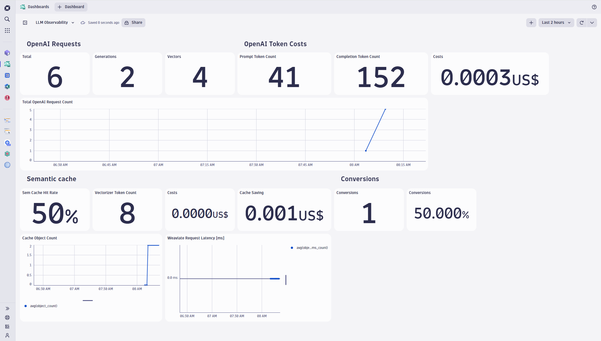
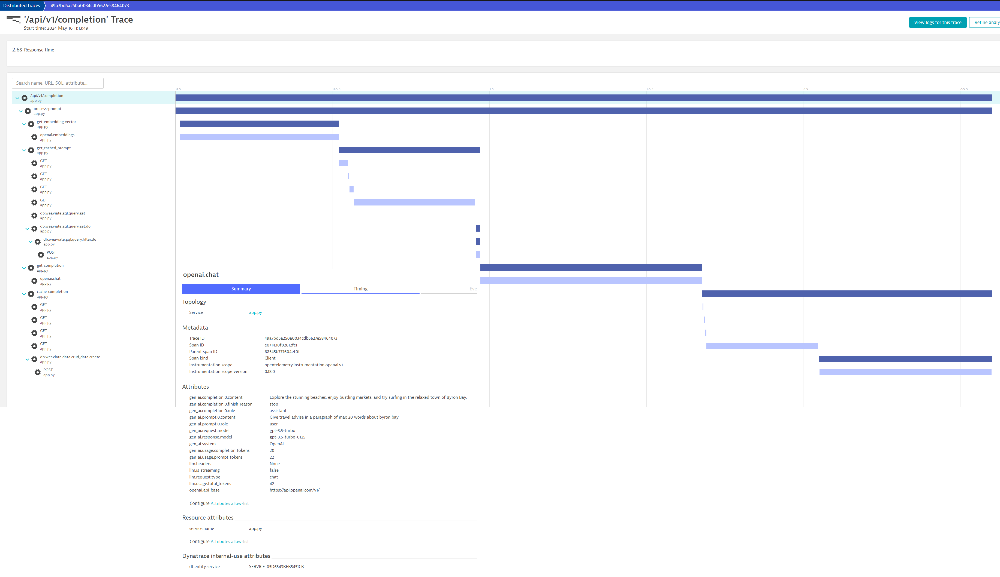

# EasyTravel GPT Travel Advisor

Demo application for giving travel advice.

Available in NodeJS and Python.

Uses OpenAI ChatGPT to generate advice for a given destination.



## ⚠️ OpenAI Paid Account Required

You need an OpenAI account with credit added to run this demo!

### Create OpenAI API Token

Go to `https://platform.openai.com/api-keys` and create a new API Key.

## Format Dynatrace URL

Make a note of your Dynatrace URL, it should be in the following format:

```
https://ENVIRONMENT-ID.live.dynatrace.com
```

For example:

```
https://abc12345.live.dynatrace.com
```

## Create Dynatrace Tokens

In Dynatrace, press `Ctrl + k` and search for `access tokens`. Choose the first option.

### DT_OPERATOR_TOKEN

Create a new access token with the following permissions:

- Create ActiveGate tokens
- Read entities
- Read Settings
- Write Settings
- Access problem and event feed, metrics and topology
- Read configuration
- Write configuration
- Paas integration - installer downloader

### DT_API_TOKEN

Create a second token with these permissions:

- Ingest metrics
- Ingest logs
- Ingest events
- Ingest OpenTelemetry
- Read metrics

### DT_WRITE_SETTINGS_TOKEN

Create a third token with this permission:

- Write settings

## 🔁 Recap

You should now have `5` pieces of information:

- The `DT_URL` (eg. `https://abc12345.live.dynatrace`)
- The `DT_OPERATOR_TOKEN`
- The `DT_API_TOKEN`
- The `DT_WRITE_SETTINGS_TOKEN`
- The `OPEN_AI_TOKEN`

When you have these pieces of information, you can proceed.

## 🆙 Time to Fire it up

- On the repo page of Github.com, click the green `Code` button and toggle to `Codespaces`.
- Click the "three dots" and choose "New with Options".
- Enter the values you've from above, in the form fields.
- Create the codespace.



After the codespaces has started (in a new browser tab), the post creation script should begin. This will install everything and will take a few moments.

When the script has completed, a success message will briefly be displayed (it is so quick you'll probably miss it) and an empty terminal window will be shown.


You may now proceed...

## Accessing and Using Demo

In the codespace, switch to the `Ports` tab. Right click port `30100` and choose `Open in Browser`



A new browser tab will open and you should see the demo.


## Using LLM-based Destination Search

Type the name of a destination (eg. `Vienna`) into the search bar and click the `Advise` button.

### What Happens Next?

- The application will request information for your destination from OpenAI using ChatGPT 3.5.
- A result will be returned from OpenAI
- The result is cached in the weviate vector cache

So if you search for `London` again, this time, the result will be served from the cache - saving you the roundtrip (and $) to OpenAI / ChatGPT.

## Visualising Data in Dynatrace

### Uploading the Dashboards
This demo comes with several prebuilt dashboards. Do the following in Dynatrace.

- Save the contents of [dynatrace/dashboards/k8s/openai/dashboard.json](dynatrace/dashboards/k8s/openai/dashboard.json) to your computer
- Press  `Ctrl + k` and search for `dashboards` or select the icon from the left toolbar
- Select the `Upload` button and upload the JSON file.




Repeat this process for the following dashboards:

- [dynatrace/dashboards/weaviate/Weaviate-Snapshots.json](dynatrace/dashboards/weaviate/Weaviate-Snapshots.json)
- [dynatrace/dashboards/weaviate/Weaviate-Importing-Data.json](dynatrace/dashboards/weaviate/Weaviate-Importing-Data.json)
- [dynatrace/dashboards/weaviate/Weaviate-LSM-Store.json](dynatrace/dashboards/weaviate/Weaviate-LSM-Store.json)
- [dynatrace/dashboards/weaviate/Weaviate-Object-Operations.json](dynatrace/dashboards/weaviate/Weaviate-Object-Operations.json)
- [dynatrace/dashboards/weaviate/Weaviate-Query-Performance.json](dynatrace/dashboards/weaviate/Weaviate-Query-Performance.json)
- [dynatrace/dashboards/weaviate/Weaviate-Usage.json](dynatrace/dashboards/weaviate/Weaviate-Usage.json)
- [dynatrace/dashboards/weaviate/Weaviate-Schema-Transactions.json](dynatrace/dashboards/weaviate/Weaviate-Schema-Transactions.json)
- [dynatrace/dashboards/weaviate/Weaviate-Startup-Times.json](dynatrace/dashboards/weaviate/Weaviate-Startup-Times.json)
- [dynatrace/dashboards/weaviate/Weaviate-Tombstone-Analysis.json](dynatrace/dashboards/weaviate/Weaviate-Tombstone-Analysis.json)
- [dynatrace/dashboards/weaviate/Weaviate-Vector-Index.json](dynatrace/dashboards/weaviate/Weaviate-Vector-Index.json)

## Run Locally with Weaviate Cache

- Download the [latest Weaviate binary from GitHub](https://github.com/weaviate/weaviate/releases/latest). Add it to your `PATH`.
- Download the [latest Dynatrace OpenTelemetry collector binary from GitHub](https://github.com/Dynatrace/dynatrace-otel-collector/releases). Add it to your `PATH`.

```
##### 1. Start Weaviate

set PROMETHEUS_MONITORING_ENABLED=true
weaviate --host 0.0.0.0 --port 8000 --scheme http

##### 2. Configure these variables and Start Collector
#####  Token needs: logs.ingest, metrics.ingest and openTelemetryTrace.ingest permissions

set DT_ENDPOINT=https://abc12345.live.dynatrace.com/api/v2/otlp
set API_TOKEN=dt0c01.******.******
dynatrace-otel-collector.exe --config ./run-locally/otelcol-config.yaml

##### Start app
set OPENAI_API_KEY=sk-proj-**********
set WEAVIATE_ENDPOINT=http://localhost:8000
# Disable usage telemetry that is sent to Traceloop
set TRACELOOP_TELEMETRY=false
python app.py
```



--------------------------

## Configuration

The travel advisor can be configured through setting the following environment variables:

- **OPENAI_API_KEY**: (mandatory) Sets the OpenAI API key that is used to generate the completions.
- **COMPLETION_LENGTH**: (optional) Sets the maximum completion length that is requested at OpenAI to reduce token cost. Default is set to 20 words (tokens).
- **WEAVIATE_ENDPOINT**: (optional) Enables the use of Weaviate vector database as semantic cache, e.g.: '192.168.0.110:8080'.
- **CACHE_MINUTES**: (optional) The prompt cache time in minutes. Default is set to 60 minutes.

## Dependencies

```bash
npm install winston
npm install openai
npm install express
npm install weaviate-ts-client
```

## Run

```bash
docker pull wolfgangb33r/travelguide:latest
docker run -d --network="host" -e "OPENAI_API_KEY=<YOUR_OPENAI_KEY>" -e "COMPLETION_LENGTH=100" -e "WEAVIATE_ENDPOINT=localhost:9999" -p 8080:8080 wolfgangb33r/travelguide:latest

docker pull semitechnologies/weaviate

docker run -d -v "/home/ec2-user/wdata:/var/lib/weaviate" -e "PERSISTENCE_DATA_PATH=/var/lib/weaviate" -e "PROMETHEUS_MONITORING_ENABLED=true" -e "AUTHENTICATION_ANONYMOUS_ACCESS_ENABLED=true" -e "DEFAULT_VECTORIZER_MODULE=none" -e "AUTOSCHEMA_ENABLED=false" -e "ENABLE_MODULES=text2vec-openai" -p 9999:8080 -p 2112:2112 semitechnologies/weaviate
```

## Deploy K8S

```bash
kubectl create namespace travel-advisor
kubectl apply -f ./deployment/deployment_with_weaviate.yaml -n travel-advisor
kubectl get services -o wide -n travel-advisor
kubectl delete deployment travel-advisor -n travel-advisor
kubectl delete service travel-advisor-service -n travel-advisor
```


## Dynatrace

* Docker image log is visible on process group page
* Create a log ingestion rule for the process group in Settings > Log monitoring > Log ingest rules
* Restart the OneAgent with 'sudo systemctl stop oneagent' and start it again
* Create a Log processing rule: 
* 
```
    matchesPhrase(content, "prompt_tokens")
    PARSE(content,"LD '\"prompt_tokens\":' INT:promt_tokens ',\"completion_tokens\":' INT:completion_tokens ',\"total_tokens\":' INT:total_tokens")
```

## Dynatrace Grail/DQL

Sum the total prompt token count with the following DQL dashboard query:

```
fetch logs
| filter k8s.namespace.name == "travel-advisor"
| filter matchesPhrase(content, "gpt-3.5")
| parse content, "LD '\"prompt_tokens\":' INT:promptTokens"
| parse content, "LD '\"completion_tokens\":' INT:completionTokens"
| parse content, "LD '\"model\":' STRING:llmModel"
| summarize promptTokensCount = sum(promptTokens)
```

Calculate the OpenAI costs by applying the current token prices for the prompt tokens as well as the sum of the completion tokens.
Mind that OpenAI pricing differentiates between prompt tokens and completion tokens as well as by model used.

```
fetch logs
| filter k8s.namespace.name == "travel-advisor"
| filter matchesPhrase(content, "gpt-3.5") 
| parse content, "LD '\"prompt_tokens\":' INT:promptTokens"
| parse content, "LD '\"completion_tokens\":' INT:completionTokens"
| parse content, "LD '\"model\":' STRING:llmModel"
| summarize cost = (sum(promptTokens) / 1000.0 * 0.0010) + (sum(completionTokens) / 1000.0 * 0.0020) 
```


See example Dynatrace dashboard [here](dynatrace/dashboard.json)


