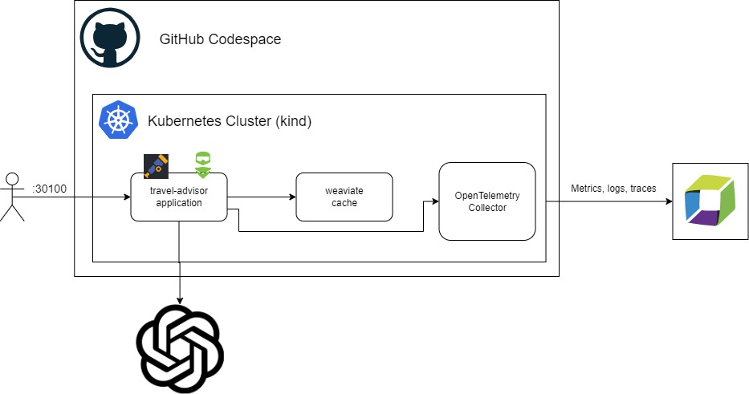

# EasyTravel GPT Travel Advisor

Demo application for giving travel advice written in Python. Observability signals by [OpenTelemetry](https://opentelemetry.io).

Uses OpenAI ChatGPT to generate advice for a given destination.




## How it works
The user interacts with the demo app (travel advisor) on port `30100`. The app is monitored either via native OpenTelemetry (as per the demo) or (if the user chooses) the OneAgent (eg. the nodeJS version).
In both cases, the user enters a destination (eg. `Sydney`). The application first checks the cache. If a response for `Sydney` is found, the response is returned from the cache.
If a cached response is not available, the application requests advice from the LLM (OpenAI's ChatGPT). When the response is returned, it is cached so that subsequent calls for the same destination (eg. `Sydney`) are served from the cache.
This saves roundtrips to ChatGPT and thus `$`.

## "Standard" Version vs. "RAG" Version

This demo is available in two flavours.

The "standard" demo uses OpenAI's ChatGPT (coupled with an on-cluster Weaviate cache) to look up destination advice for any destination.

The "RAG" version (available on the `rag` branch) will **only** produce destination advice for places the system has explicitly been trained on (the files in the [destinations folder on the `rag` branch](https://github.com/dynatrace-perfclinics/traveladvisor/tree/rag/destinations)). Namely, `Bali` and `Sydney`.

The RAG version of the demo mimicks training an LLM on an internal knowledgebase.

## ⚠️ OpenAI Paid Account Required

You need an OpenAI account with credit added to run this demo!

### Why?

OpenAI / ChatGPT severely limits the ability for API access if you do not have credit. Adding a small amount of credit ($2-$3) is the best way to make this (and all other ChatGPT demos) run smoothly.

We have developed, tested and demoed this repository hundreds of times and still have money left from the initial $5 credit load.

### Create OpenAI API Token

Go to `https://platform.openai.com/api-keys` and create a new API Key.

## Format Dynatrace URL

Make a note of your Dynatrace URL, it should be in the following format:

```
https://ENVIRONMENT-ID.live.dynatrace.com
```

For example:

```
https://abc12345.live.dynatrace.com
```

## Create Dynatrace Token

In Dynatrace, press `Ctrl + k` and search for `access tokens`. Choose the first option.

### DT_API_TOKEN

Create an API token with these permissions:

- Ingest metrics (`metrics.ingest`)
- Ingest logs (`logs.ingest`)
- Ingest events (`events.ingest`)
- Ingest OpenTelemetry traces  (`openTelemetryTrace.ingest`)
- Read metrics (`metrics.read`)
- Write settings  (`settings.write`)

This token will be used by the OpenTelemetry collector and k6 to send data to Dynatrace.
The setup script which runs automatically when the codespace is created also uses this to [configure span attribute capture rules in Dynatrace](https://github.com/dynatrace-perfclinics/traveladvisor/blob/82cedeac2bbe2a6e59c5a94f8a798ff81e204660/.devcontainer/deployment.sh#L5)
this means the relevant OpenTelemetry span attributes will automatically be stored.

## 🔁 Recap

You should now have `3` pieces of information:

- The `DT_ENDPOINT` (eg. `https://abc12345.live.dynatrace`)
- The `DT_API_TOKEN`
- The `OPEN_AI_TOKEN`

When you have these pieces of information, you can proceed.

## 🆙 Time to Fire it up

Click here to start the codespace:

[](https://codespaces.new/dynatrace-perfclinics/traveladvisor)

After the codespaces has started (in a new browser tab), the post creation script should begin. This will install everything and will take a few moments.

When the script has completed, a success message will briefly be displayed (it is so quick you'll probably miss it) and an empty terminal window will be shown.


You may now proceed.

## Accessing and Using Demo

In the codespace, switch to the `Ports` tab. Right click port `30100` and choose `Open in Browser`


A new browser tab will open and you should see the demo.


## Using LLM-based Destination Search

Type the name of a destination (eg. `Vienna`) into the search bar and click the `Advise` button.

### What Happens Next?

- The application will request information for your destination from OpenAI using ChatGPT 4o mini.
- A result will be returned from OpenAI
- The result is cached in the weviate vector cache

So if you search for `Vienna` again, this time, the result will be served from the cache - saving you the roundtrip (and $) to OpenAI / ChatGPT.

## Visualising Data in Dynatrace

### Uploading the Dashboards
This demo comes with several prebuilt dashboards. Do the following in Dynatrace.

- Save the contents of [dynatrace/dashboards/openai/Travel-Advisor-Overview.json](dynatrace/dashboards/openai/Travel-Advisor-Overview.json) to your computer
- Press  `Ctrl + k` and search for `dashboards` or select the icon from the left toolbar
- Select the `Upload` button and upload the JSON file.


Repeat this process for all the dashboards inside [dynatrace/dashboards/*](dynatrace/dashboards)

## Run Locally with Weaviate Cache

- Download the [latest Weaviate binary from GitHub](https://github.com/weaviate/weaviate/releases/latest). Add it to your `PATH`.
- Download the [latest Dynatrace OpenTelemetry collector binary from GitHub](https://github.com/Dynatrace/dynatrace-otel-collector/releases). Add it to your `PATH`.

```
##### 1. Start Weaviate

set PROMETHEUS_MONITORING_ENABLED=true
weaviate --host 0.0.0.0 --port 8000 --scheme http

##### 2. Configure these variables and Start Collector
#####  Token needs: logs.ingest, metrics.ingest and openTelemetryTrace.ingest permissions

set DT_ENDPOINT=https://abc12345.live.dynatrace.com/api/v2/otlp
set API_TOKEN=dt0c01.******.******
dynatrace-otel-collector.exe --config ./run-locally/otelcol-config.yaml

##### Start app
set OPENAI_API_KEY=sk-proj-**********
set WEAVIATE_ENDPOINT=http://localhost:8000
# Disable usage telemetry that is sent to Traceloop
set TRACELOOP_TELEMETRY=false
python app.py
```


--------------------------

## Configuration

The travel advisor can be configured through setting the following environment variables:

- **OPENAI_API_KEY**: (mandatory) Sets the OpenAI API key that is used to generate the completions.
- **COMPLETION_LENGTH**: (optional) Sets the maximum completion length that is requested at OpenAI to reduce token cost. Default is set to 20 words (tokens).
- **WEAVIATE_ENDPOINT**: (optional) Enables the use of Weaviate vector database as semantic cache, e.g.: '192.168.0.110:8080'.
- **CACHE_MINUTES**: (optional) The prompt cache time in minutes. Default is set to 60 minutes.

## Dependencies

```bash
npm install winston
npm install openai
npm install express
npm install weaviate-ts-client
```

## Run

```bash
docker pull wolfgangb33r/travelguide:latest
docker run -d --network="host" -e "OPENAI_API_KEY=<YOUR_OPENAI_KEY>" -e "COMPLETION_LENGTH=100" -e "WEAVIATE_ENDPOINT=localhost:9999" -p 8080:8080 wolfgangb33r/travelguide:latest

docker pull semitechnologies/weaviate

docker run -d -v "/home/ec2-user/wdata:/var/lib/weaviate" -e "PERSISTENCE_DATA_PATH=/var/lib/weaviate" -e "PROMETHEUS_MONITORING_ENABLED=true" -e "AUTHENTICATION_ANONYMOUS_ACCESS_ENABLED=true" -e "DEFAULT_VECTORIZER_MODULE=none" -e "AUTOSCHEMA_ENABLED=false" -e "ENABLE_MODULES=text2vec-openai" -p 9999:8080 -p 2112:2112 semitechnologies/weaviate
```

## Deploy on a Local K8S Cluster

You will need [Docker](https://docs.docker.com/engine/install/) or [Podman](https://podman.io/docs/installation) installed and [Helm](https://helm.sh/docs/intro/install/).

`git clone` this repository locally:

```bash
git clone https://github.com/dynatrace-perfclinics/traveladvisor
cd traveladvisor
```

Create a cluster if you do not already have one:
```bash
kind create cluster --config .devcontainer/kind-cluster.yml --wait 300s
```

Customise and set some environment variables
```
export DT_ENDPOINT=https://abc12345.live.dynatrace.com
export DT_TOKEN=TODO
export OPEN_AI_TOKEN=******
```

Run the deployment script:
```bash
.devcontainer/deployment.sh
```
