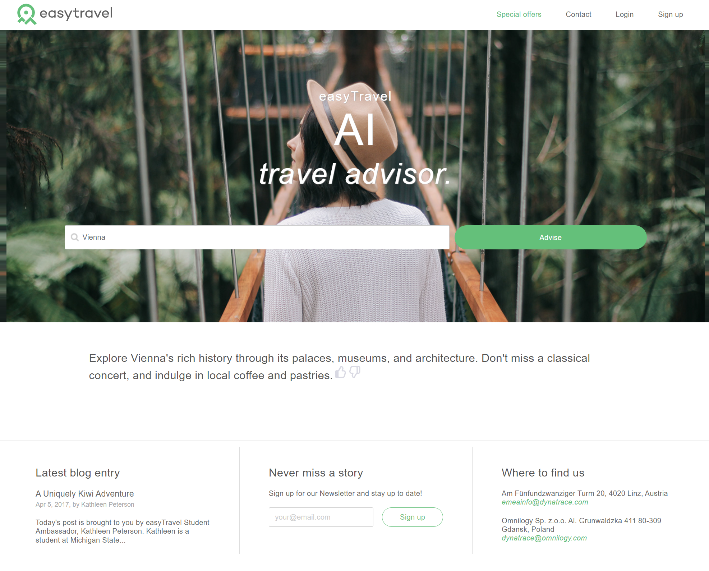

# AI Observability Hands On with Local Guardrails and Tool Calling

This branch contains two demos:

1. An AI based "travel advisor" application which uses a local model (`qwen3`) running on Ollama. The application also contains a local guardrail that (tries to) prevent application misuse by blocking any non travel related searches.
1. A second travel advice application. This one leverages the agentic "tool calling" pattern to answer this query:
    * Given a destination, answer three questions:
       1) What's the weather like at the destination?
       2) How far away from Las Vegas is the destination?
       3) What is the flight time from Las Vegas to the destination?

Both applications emit and capture telemetry data via OpenTelemetry.

> **Note**
> This product is not officially supported by Dynatrace!



## Prerequisites

* Docker or Podman installed
* Python 3 installed
* Dynatrace environment (if you need one, sign up for a [free trial here](https://dt-url.net/trial))

## Create a Virtual Environment

```
python -m venv .
Scripts\activate.bat
```

## Install Dependencies

```
pip install -r requirements.txt
```

## Upload Dynatrace Notebook

In Dynatrace:

* Press `ctrl + k` and search for `Notebooks`
* Upload [dynatrace/notebooks/AI Observability - Hands On.json](dynatrace/notebooks/AI%20Observability%20-%20Hands%20On.json) using the upload button

## Generate API Token

In Dynatrace:

* Press `ctrl + k` and search for `Access tokens`
* Create a new token with the following permissions:
    * `metrics.ingest`
    * `logs.ingest`
    * `openTelemetryTrace.ingest`

Make a note of your API token.

Next, make a note of your environment ID. It is the first portion of the URL.

For example, `abc12345` is the environment ID of `https://abc12345.apps.dynatrace.com`

You'll need these two pieces of data later.

## Start Ollama & Pull Model

Start Ollama running locally on the standard port of `11434` and pull the `qwen3:0.6b` model.

```
docker pull ollama/ollama:0.13.3
docker run -d -v ollama:/root/.ollama -p 11434:11434 --name ollama ollama/ollama:0.13.3
docker exec -it ollama ollama pull qwen3:0.6b
```

## Start Collector

The application(s) will send OpenTelemetry data to this collector. The collector will then process and forward the data to your Dynatrace environment.

Update the variables below as per YOUR details then start the collector.

Leave this running.

```
set DT_ENDPOINT=https://abc12345.live.dynatrace.com
set API_TOKEN=dt0c01.**********.************
docker run -p 4318:4318 -v collector.yaml:/etc/otelcol/otel-collector-config.yaml -v run.log:/var/log/run.log -e DT_ENDPOINT=%DT_ENDPOINT% -e API_TOKEN=%API_TOKEN% ghcr.io/dynatrace/dynatrace-otel-collector/dynatrace-otel-collector:0.40.0 --config=/etc/otelcol/otel-collector-config.yaml
```

## Start Application

Start the Travel Advisor application which can be accessed via `http://localhost:8080`

```
python app.py
```

## Start Tutorial

Open the "AI Observability - Hands On" notebook in Dynatrace and follow the tutorial.