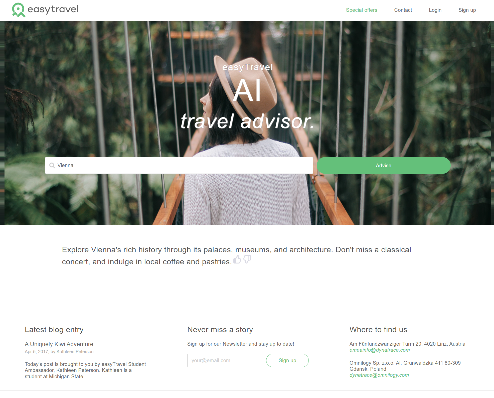
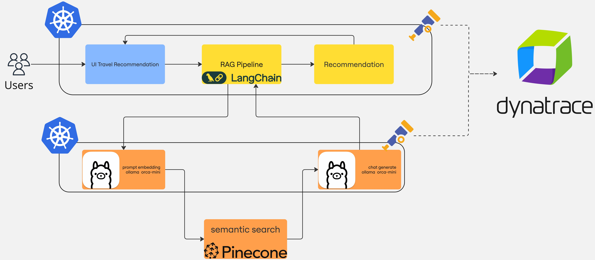

# Large Language Model Observability with Dynatrace

Demo application for giving travel advice written in Python. Observability signals by [OpenTelemetry](https://opentelemetry.io){target="_blank"} and [OpenLLMetry](https://www.traceloop.com/docs/openllmetry/introduction){target="_blank"}.

The demo application has two different versions:

- Standard
- Retrieval-augmented generation (RAG)

The standard version uses OpenAI ChatGPT to generate advice for a given destination and use Weaviate as a cache layer.
The RAG version uses Ollama to generate advice for a given destination and PineCone
to fetch additional context to refine the advice provided by Ollama.

This hands-on is also available as an [on-demand webinar](https://info.dynatrace.com/apac-all-wb-ensure-ai-project-success-with-ai-observability-24973-registration.html){target="_blank"}.

## Standard Version Architecture 

## RAG Version Architecture

## Compatibility

| Deployment         | Tutorial Compatible |
|--------------------|---------------------|
| Dynatrace Managed  | ✔️                 |
| Dynatrace SaaS     | ✔️                 |

## [>> Click here to start the tutorial...](how-it-works-standard.md)